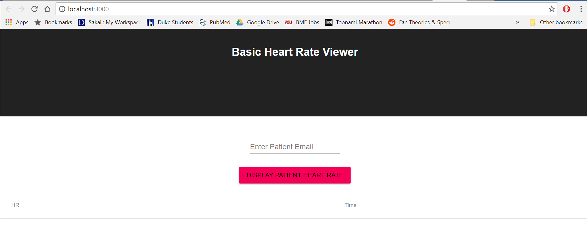
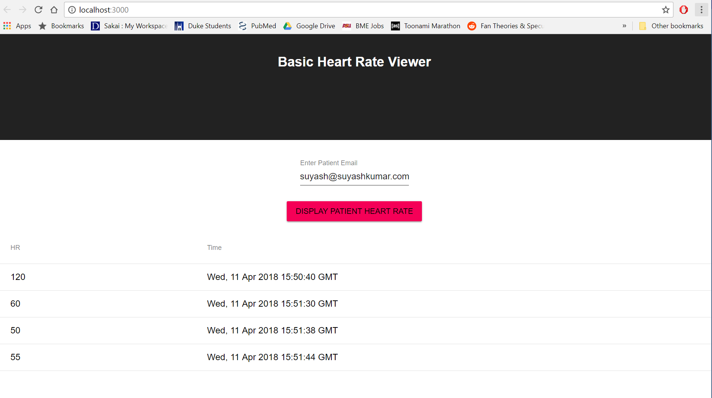

# doctor_hr_frontend

This project was bootstrapped with [Create React App](https://github.com/facebookincubator/create-react-app).
You can find the most recent version of this guide [here](https://github.com/facebookincubator/create-react-app/blob/master/packages/react-scripts/template/README.md).

## Functionality

This front end code is built using React and interfaces with existing code in 
[heart_rate_databases_starter](https://github.com/mackenna95/heart_rate_databases_starter).
The program prompts the user for a patient email. The user can then select a button named 'Display Patient Heart Rate'
to display all of the patient's heart rates and times currently in the database located in 
[heart_rate_databases_starter](https://github.com/mackenna95/heart_rate_databases_starter) through a table on screen.
All updates to the user occur when the button is selected and the user remains on the same webpage.

The data is retrieved from [heart_rate_databases_starter](https://github.com/mackenna95/heart_rate_databases_starter)
by a get request through axios. The request placed is "http://vcm-3587.vm.duke.edu:5000/api/heart_rate/<user_email>". 

## Screenshots




## Folder Structure

```
my-app/
  README.md
  node_modules/
  package.json
  public/
    index.html
    favicon.ico
  src/
    App.css
    App.js
    App.test.js
    index.css
    index.js
    logo.svg
    Table.js
  node_modules/
    ...
```

App.js contains the main React code while Table.js is the table function imported into App.js for use. All dependencies
 are stored in node_modules.
 
## Travis
Travis CI was not used for this build since testing was not implemented in the React framework.

## Setup
To setup this program one must open the command line, navigate to the 'doctor_hr_frontend' folder and enter the
following command. 

*npm run start*

Note that the database [heart_rate_databases_starter](https://github.com/mackenna95/heart_rate_databases_starter)
must be up and running on the Duke VCM to use this program.